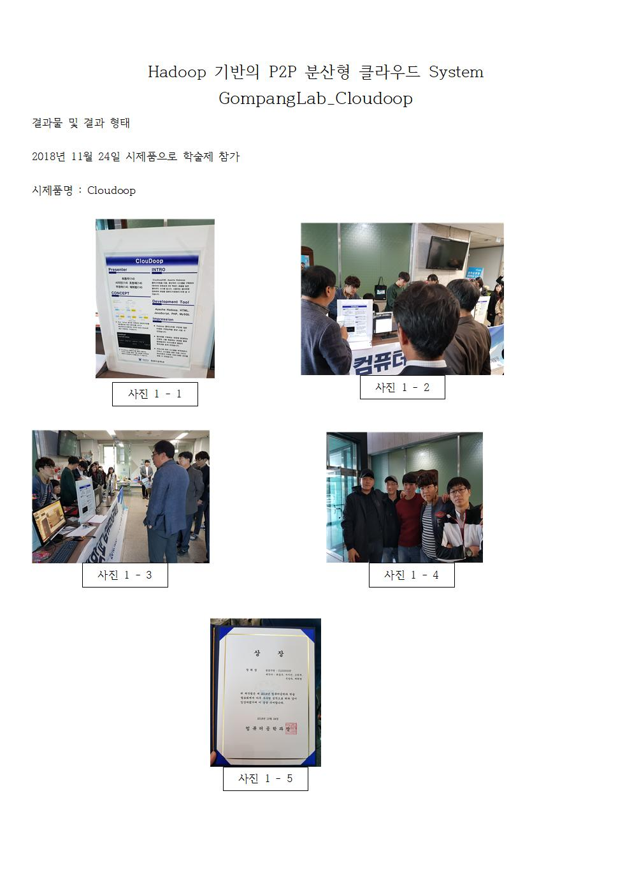
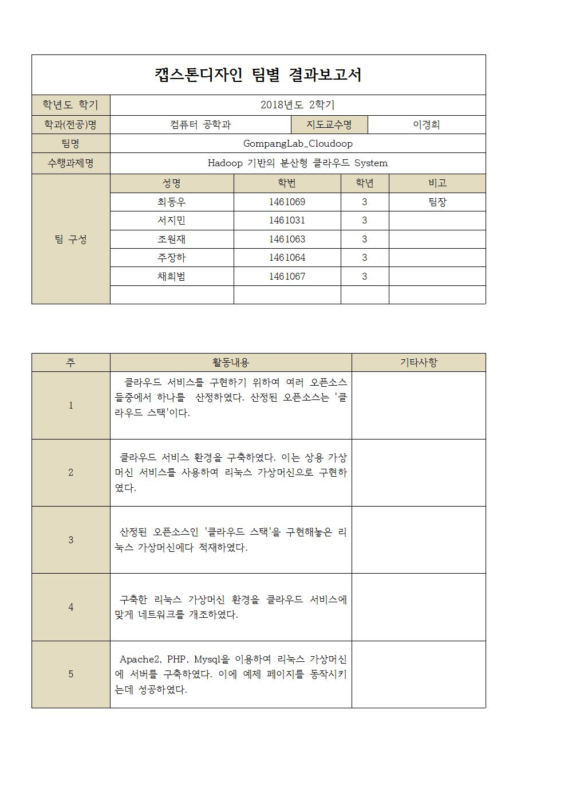
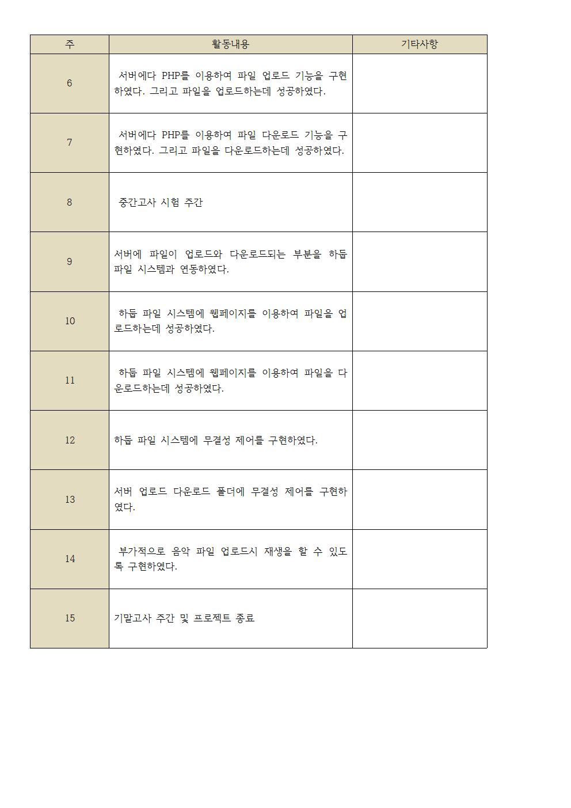

# Capstone2018
배재대학교 캡스톤 디자인 2018 동아리 Git 

# 프로젝트 설명 #
- 웹서버로 클라우드 저장소 구축
- 중앙 서버가 필요없고 Hadoop 기반으로 P2P 방식으로 구동
- 각자의 컴퓨터의 자원을 이용하여 공유 클라우드 시스템 구축

# 담당 파트 #
- Hadoop을 관리하기 위한 bash script 코딩

# 관련 내용 #

